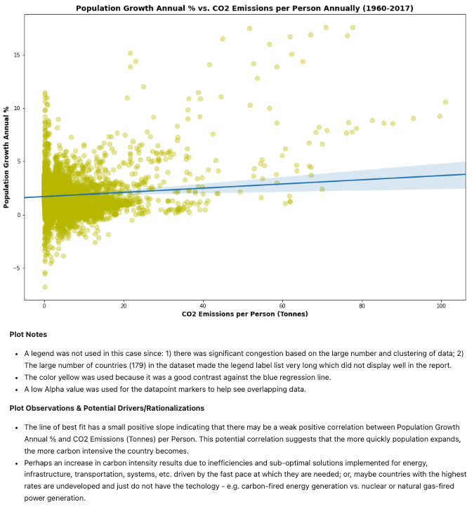
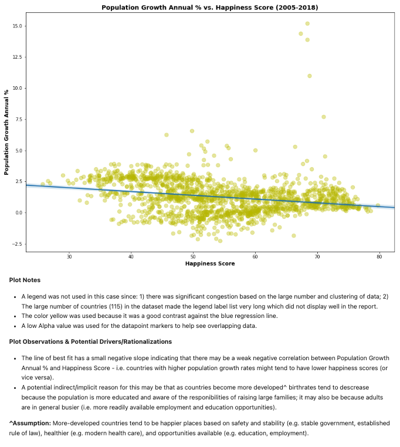
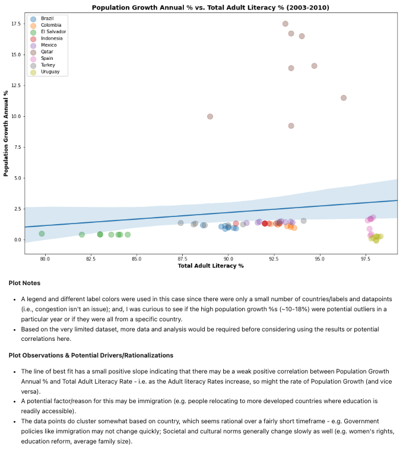
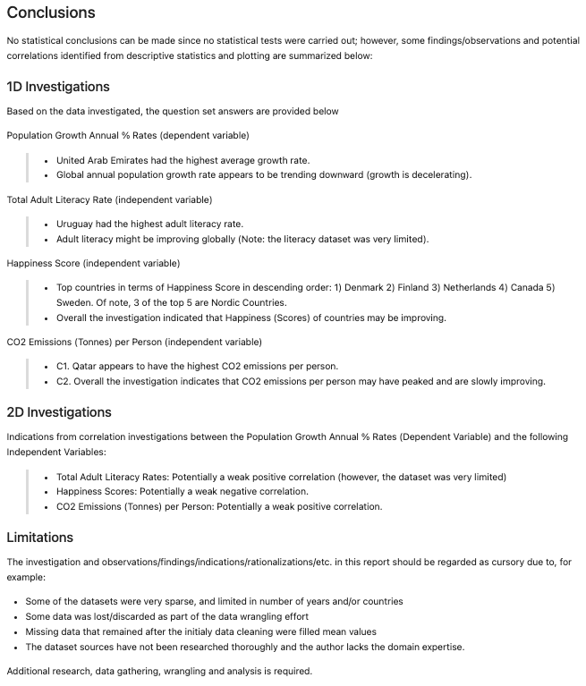

# Gapminder Datasets Investigation

## Objective
* Using Python libraries NumPy, pandas, and Matplotlib, analyze a dataset(s) and communicate your findings.

## Datasets Selected for Analysis
* Population Growth
* Literacy Rate
* Happiness Score
* CO2 Emissions

## Learning Outcomes
* Became aquainted with the steps involved in a typical data analysis process.
* Gained experience in generating and answering plausible questions given a specific dataset(s).
* Learned how to identify and investigate problems in a dataset, and wrangle/clean the data.
* Gained experience communicating the results of a data analysis.
* Experienced in using vectorized operations in NumPy and pandas to speed up data analysis code.
* Became familiar with pandas' Series and DataFrame objects.
* Learned how to use Matplotlib to produce plots illustrating your findings.

## Visualizations & Observations

 

 

## Conclusion

## References
* Udacity Data Analyst Nanodegree Documentation/Cirriculum
* Gapminder Datasets (https://www.gapminder.org/data/)
* World Bank Data (https://data.worldbank.org/indicator/SP.POP.GROW), No specific dataset version found. Downloaded Oct. 28, 2021.
* UNESCO Institute for Statistics (UIS) (http://data.uis.unesco.org/), September 2021 release. Downloaded Oct. 29, 2021.
* WHR-Happiness Score Dataset (http://gapm.io/dhapiscore_whr), Version 2 updated April 16 2021. Downloaded Oct. 29, 2021.
* Carbon Dioxide Information Analysis Center (https://cdiac.ess-dive.lbl.gov/), No specific dataset version found. Downloaded Oct. 28, 2021.

